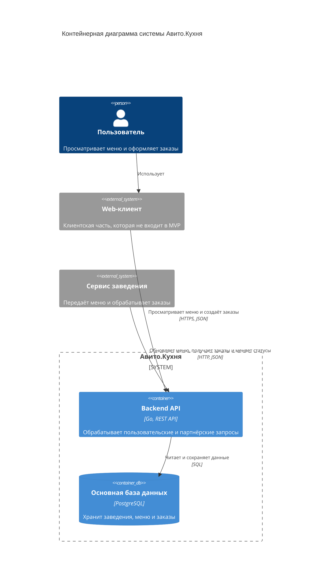

## C4 Container Diagram

Диаграмма показывает основные приложения и хранилища системы,
а также взаимодействие между ними.

```mermaid
C4Container
    title Контейнерная диаграмма системы Авито.Кухня

    Person(customer, "Пользователь", "Просматривает меню и оформляет заказы")

    System_Ext(web_client, "Web-клиент", "Клиентская часть, которая не входит в MVP")
    System_Ext(restaurant_service, "Сервис заведения", "Передаёт меню и обрабатывает заказы")

    System_Boundary(kitchen, "Авито.Кухня") {
        Container(api, "Backend API", "Go, REST API", "Обрабатывает пользовательские и партнёрские запросы")
        ContainerDb(database, "Основная база данных", "PostgreSQL", "Хранит заведения, меню и заказы")
    }

    Rel(customer, web_client, "Использует")
    Rel(web_client, api, "Просматривает меню и создаёт заказы", "HTTPS, JSON")
    Rel(restaurant_service, api, "Обновляет меню, получает заказы и меняет статусы", "HTTP, JSON")
    Rel(api, database, "Читает и сохраняет данные", "SQL")
```